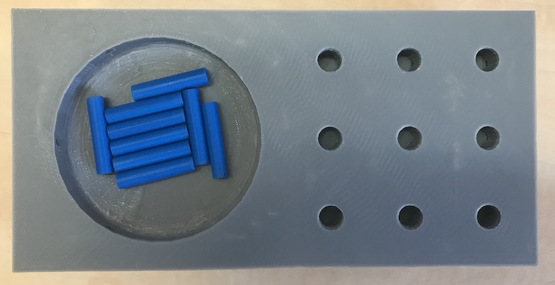

# InstrumentedNineHolePegTest
An instrumented version (i.e., with sensors) of the nine hole peg test

Details about how to build the test can be found in the 
[wiki](https://github.com/JasonFriedman/InstrumentedNineHolePegTest/wiki)

